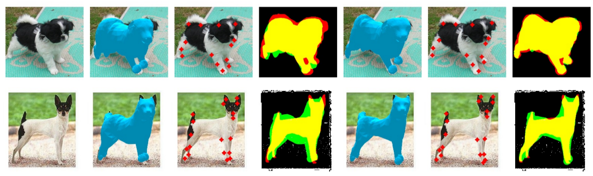
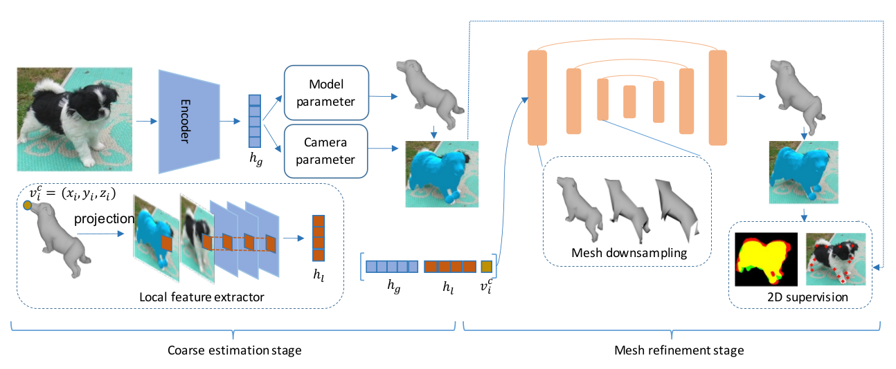

# Coarse-to-fine-3D-Animal

**About**

This is the source code for our paper

Chen Li, Gim Hee Lee. Coarse-to-fine Animal Pose and Shape Estimation. In Neurips 2021.

The shape space of the SMAL model is learned from 41 scans of toy animals and thus lacks pose ans shape variations. This may limit the representation capacity of the SMAL model and result in poor fittings of the estimated shapes to the 2D observations, as shown in the second to fourth columns of the Figure below. To mitigate this problem, we propose a coarse-to-fine approach, which combines model-based and model-free representations. Some refined results are shown in the fifth to seventh columns.

<p align="center">
  
</p>

Our network consists of a coarse estimation stage and a mesh refinement stage. The SMAL model parameters and camera parameters are regressed from the input image in the first stage for coarse estimation. This coarse estimation is further refined by an encoder-decoder structured GCN in the second stage. 

<p align="center">
  
</p>

For more details, please refer to [our paper](https://arxiv.org/pdf/2111.08176.pdf).

**Bibtex**
```
@inproceedings{li2021coarsetofine,
      title={Coarse-to-fine Animal Pose and Shape Estimation}, 
      author={Chen Li and Gim Hee Lee},
      year={2021},
      booktitle={NeurIPS},
}
```

**Dependencies**
1. Python 3.7.10
2. Pytorch 1.5.0

Please refer to requirements.txt for more details on dependencies.

**Download datasets**
* Download the [StanfordExtra dataset](https://github.com/benjiebob/StanfordExtra) and put it under the folder ./data/.

* Download the [Animal Pose dataset](https://sites.google.com/view/animal-pose/) and the test split from [WLDO](https://github.com/benjiebob/WLDO/tree/master/data/animal_pose) and put them under the foder ./data/.

**Train**

We provide the [pretrained model](https://drive.google.com/file/d/1mvr7iYkyKVUxPdFExE0HOsrVNl_sc1O1/view?usp=sharing) for each stage. You can download the pretrained models and put them under the folder ./logs/pretrained_models/. To save training time, You can directly train from stage 2 using our pretrained model for stage 1 ('stage1.pth.tar') by running: 
```
python main_meshgraph.py --output_dir logs/stage2 --nEpochs 10 --local_feat --batch_size 32 --freezecoarse --gpu_ids 0 --pretrained logs/pretrained_models/stage1.pth.tar
```
Then you can continue to the training for stage 3 by running:
```
python main_meshgraph.py --output_dir logs/stage3 --nEpochs 200 --lr 1e-5 --local_feat --w_arap 10000 --w_dice 1000 --w_dice_refine 100 --w_pose_limit_prior 5000 --resume logs/pretrained_models/stage2.pth.tar --gpu_ids 0
```
Note that you will have to change the '--resume' to the path of your own model if you want to use your own model from stage 2. 

Alternatively, you can also train from scratch. In this case, you will need to pretrain the coarse estimation part first by running:
```
python main.py --batch_size 32 --output_dir logs/stage1 --gpu_ids 0
```
Then you can continue to train stage 2 and stage 3 as we have explained. Note that you will need to change the '--pretrain' in stage 2 and '--resume' in stage 3 to the path of your own model.

**Test**

Test our model on the StandfordExtra dataset by running:
```
python eval.py --output_dir logs/test --resume logs/pretrained_models/stage3.pth.tar --gpu_ids 0 --local_feat
```
or on the Animal Pose dataset by running:
```
python eval.py --output_dir logs/test --resume logs/pretrained_models/stage3.pth.tar --gpu_ids 0 --local_feat --dataset animal_pose
```
Qualitative results can be genrated and saved by adding '--save_results' to the command. 

**Acknowledgements**

The code for the coarse estimation stage is adopted from [WLDO](https://github.com/benjiebob/WLDO/tree/master/data/animal_pose). If you use the coarse estimation pipeline, please cite:
```
@inproceedings{biggs2020wldo,
  title={{W}ho left the dogs out?: {3D} animal reconstruction with expectation maximization in the loop},
  author={Biggs, Benjamin and Boyne, Oliver and Charles, James and Fitzgibbon, Andrew and Cipolla, Roberto},
  booktitle={ECCV},
  year={2020}
}
```
